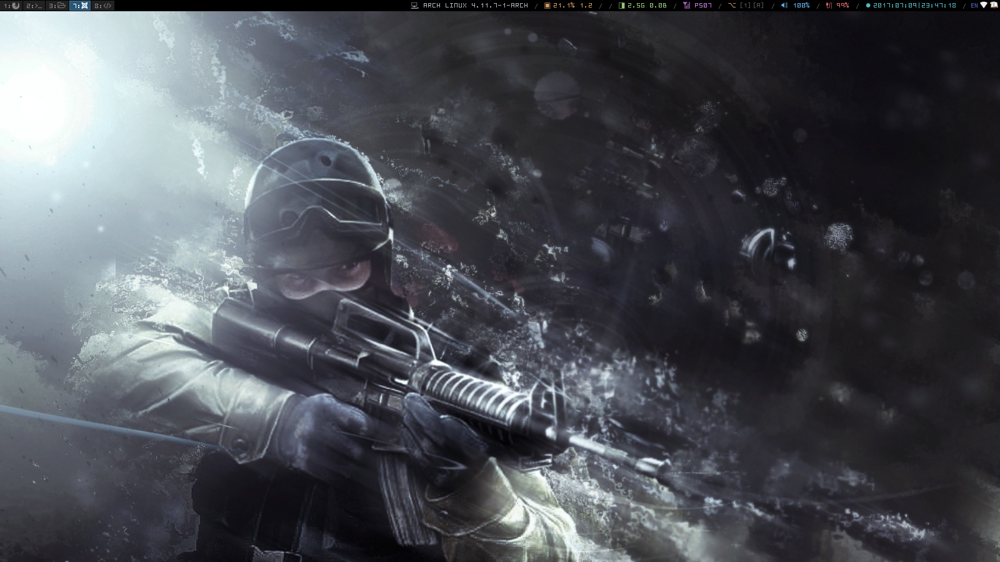

## i3wm
- i3wm config with [i3blocks](https://github.com/vivien/i3blocks).
- Uses [OhSnap](https://sourceforge.net/projects/osnapfont/) font.
- i3wm + i3blocks configs: Edit `{config,i3blocks.conf}` files
- Thinkpab T430 : `thinkfan.conf`


Download :
```
git clone https://github.com/duyhenryer/i3wm-config.git

```

